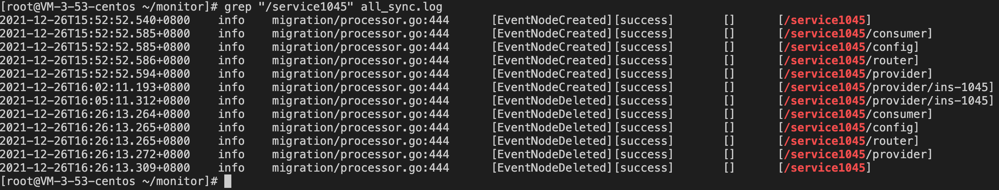
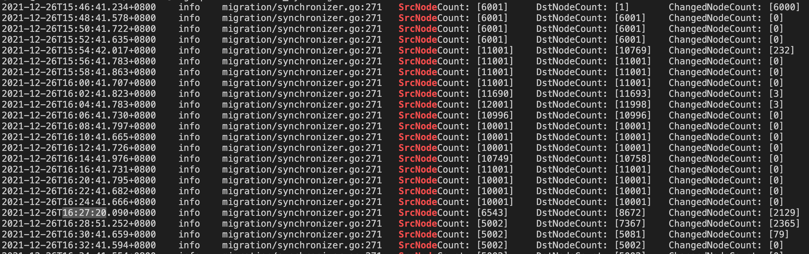

# zk2zk

## 简介

zk2zk 是一款zookeeper 热迁移工具，帮助用户从自建平滑迁移到腾讯云

zk2zk 包含两个子工具：

- all_sync用于将源ZK 的持久化和临时节点同步到目的ZK
- t_sync用于将目的ZK 的临时节点同步到源ZK

通常配置数据是持久化节点，迁移过程：

- 源ZK 的配置数据由all_sync 同步到目的ZK
- 对于接入目的ZK 的客户端，可以读取源ZK 的配置数据
- 在迁移过程中，只允许在源ZK 上修改配置数据

通常注册数据是临时节点，迁移过程：

- 接入源ZK 的客户端数据由all_sync 同步到目的ZK
- 对于接入目的ZK 的客户端，可以读取注册到源ZK 的客户端数据
- 接入目的ZK 的客户端数据由t_sync 同步到源ZK
- 对于还在源ZK 的客户端，可以读取注册到目的ZK 的客户端数据

## 快速入门

#### 下载工具

从[release](https://github.com/tencentyun/tse-tools/releases) 下载最新版本的程序包

#### 启动工具

```shell
# 启动all_sync
./all_sync start --srcAddr [SRC_ADDR:SRC_PORT] --dstAddr [DST_ADDR:DST_PORT]

# 启动t_sync
./t_sync start --srcAddr [DST_ADDR:DST_PORT] --dstAddr [SRC_ADDR:SRC_PORT]
```

其中，SRC_ADDR:SRC_PORT表示源ZK 的访问地址，DST_ADDR:DST_PORT表示目的ZK 的访问地址

#### 客户端迁移

步骤一

- 操作：在TSE上创建一个zookeeper实例作为目的ZK

步骤二

- 操作：启动all_sync和t_sync
- 检查：在目的ZK 上可以查到源ZK 的全部数据

步骤三

- 操作：客户端接入逐步从源ZK 切换到目的ZK
- 检查：在目的ZK 和源ZK 上都可以查到切换的客户端数据

步骤四

- 操作：在全部客户端切换到目的ZK后，停止源ZK

#### 异常处理

- 源ZK 故障：当源ZK 恢复正常时，zk2zk可以继续工作，无需处理
- 目的ZK 故障：当源ZK 恢复正常时，zk2zk可以继续工作，无需处理
- all_sync 故障：重启all_sync，数据可以继续同步
- t_sync 故障：重启t_sync，数据可以继续同步

#### 注意事项

- all_sync 和t_sync 在同步临时节点时，会将临时节点转换为持久化节点。通常不影响客户端读取
- t_sycn 会在目的ZK 上创建/zk2zk_migration 节点，在该节点下记录从目的ZK 同步到源ZK 的临时节点
- all_sync 在同步数据时，会从目的ZK 上读取/zk2zk_migration 进行对比，避免循环同步数据

## 使用指南

#### 查看日志

`all_sync` 和 `t_sync` 在启动之后，都会在当前运行目录下，创建两类日志目录`runtime`和`monitor`。
`runtime` 中保存的是程序运行的日志，`monitor` 中保存的是程序的审计日志。  

对于运行日志，其记录了程序内部的运行情况，通过运行日志，可以了解程序的运行状态。  

对于审计日志，其记录了两类信息：  
- 一类是节点的操作信息，zk2zk会以 `[操作]\t[结果]\t[额外信息]\t[操作对象]` 的结构输出对某个节点进行过的同步操作。
示例日志如下所示，日志记录了客户端在源ZK对`/service1045`进行操作时，`all_sync` 程序在目的ZK同步进行的操作。


  
- 一类是程序的同步进度信息，zk2zk会以 `SrcNodeCount: [%d]\tDstNodeCount: [%d]\tChangedNodeCount: [%d]` 的结构输出src端的节点个数、dst端的节点个数、对账会影响的节点个数。
我们可以通过`grep SrcNodeCount` 来了解到整个同步工具的运行进度。当然，`/zookeeper`和`/zk2zk_migration`自身以及其子节点不会被计算在内。
示例日志如下所示，日志记录了同步程序运行时，源ZK和目的ZK节点的同步进度。

  

#### 启动参数

在启动zk2zk的时候，可以通过执行时添加`-h`参数来了解更多可选选项。

```
~ % ./all_sync start -h

start and synchronize nodes from source to target

Usage:
  all_sync start [flags]

Flags:
      --LogCompress                     whether compress log file
      --dstAddr stringArray             the zookeeper address of target, required option
      --dstSession int                  the second of target zookeeper session timeout (default 10)
  -h, --help                            help for start
      --logEnableStdout                 whether print log to stdout (default true)
      --logLevel string                 log level, options are debug/info/warn/error (default "info")
      --logMaxBackup int                the maximum number of old log files to retain (default 30)
      --logMaxFileSize int              the maximum size in megabytes of the log file before log gets rotated (default 30)
      --logPath string                  the path of the log file saved (default "./runtime/all_sync.log")
      --monitorLogPath string           the path of the monitor log file saved (default "./monitor/all_sync.log")
      --path string                     the root path of node which synchronized (default "/")
      --srcAddr stringArray             the zookeeper address of source, required option
      --srcSession int                  the second of source zookeeper session timeout (default 10)
      --syncCompareConcurrency int      the sync compare concurrency
      --syncDailyInterval int           the daily sync interval
      --syncSearchConcurrency int       the sync search concurrency
      --tunnelLength int                the number of tunnel length (default 100)
      --watcherCompareConcurrency int   the watcher compare concurrency
      --watcherReWatchConcurrency int   the watcher rewatch concurrency
      --workerBufferSize int            the number of buffer which worker used
      --workerNum int                   the number of workers which are used to apply changes
      --workerRetryCnt int              the count of worker retry if failed
      --zkEventBuffer int               the length of zookeeper event buffer
      --zkEventWorkerLimit int          the limit number of zookeeper event handler
```

## 如何构建

依赖 [Golang 1.16]()

```
make all
```
